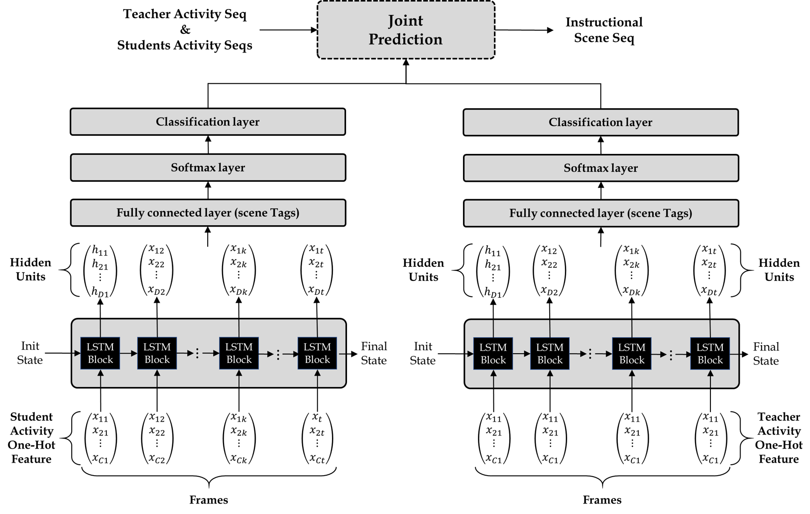

# Instructional Activity - Scene Sequence Prediction Model (IA2S)

基于教学活动，预测教学场景，进行个体分析。本库提供了训练器、评估工具、预测工具和分析工具。

## Overview

### 网络结构



### 模型目的

1. 联合教师活动序列与学生活动序列，预测教学场景序列；
2. 基于个体活动序列的场景预测概率分布与真实场景情况的对照，分析个体状态，发现异常序列。

## Usage

### readData: 读取规范格式数据

读取数据。具体调用方法如下。

```
Usage: [SXTrain,SYTrain,TXTrain,TYTrain,SXTest,SYTest,TXTest,TYTest,SXPredict,TXPredict,sceneTags,classNames] = readData(actSeqFile,sceneSeqFile,actTagsFile,sceneTagsFile,setFile)
Input:
  actSeqFile: Activity sequence CSV file.
  sceneSeqFile: Scene sequence CSV file.
  actTagsFile: Available activity tags CSV file.
  sceneTagsFile: Available scene tags CSV file.
  setFile: The CSV file that determines the division of the training set from the test set.
Output:
  SXTrain: Student train set (Activities).
  SYTrain: Student train set (Scenes).
  TXTrain: Teacher train set (Activities).
  TYTrain: Teacher train set (Scenes).
  SXTest: Student test set (Activities).
  SYTest: Student test set (Scenes).
  TXTest: Teacher test set (Activities).
  TYTest: Teacher test set (Scenes).
  SXPredict: Student predict set (Activities).
  TXPredict: Teacher predict set (Activities).
  SceneTags: Scene tags array.
  ClassNames: Classes array.
```

数据文件的具体格式：

actSeqFile: csv文件，一行代表一个角色在一个课例中的活动序列，每个单元格为一帧。特别地，第一列为课例编号，第二列为角色类别（S/T），第三列为角色编号，第四列为活动范畴（Act/Gaze）。

sceneSeqFile: csv文件，一行代表一个课例的活动序列，每个单元格为一帧。特别地，第一列为课例编号。

actTagsFile: csv文件，一行代表一个可用的活动标签。第一列为角色类别（S/T），第二列为活动范畴（Act/Gaze），第三列为活动标签全称。

sceneTagsFile: csv文件，一行代表一个可用的场景标签。

setFile: csv文件，用以划分数据集。第一列为课例编号，第二列为角色编号，第三列为其数据集归属情况（Train - 用于训练，Test - 用于测试，Predict - 用于预测）。

### train: 训练预测模型

利用训练集，训练得出学生活动-场景预测模型**SNet**和教师活动-场景预测模型**TNet**，具体调用方法如下。

```
Usage: [SNet,TNet] = train(SXTrain,TXTrain)
Input:
  SXTrain: Student train set (Activities).
  SYTrain: Student train set (Scenes).
  TXTrain: Teacher train set (Activities).
  TYTrain: Teacher train set (Scenes).
  sceneTags: Scene tags array.
Output:
  SNet: Trained LSTM Net using student sequences.
  TNet: Trained LSTM Net using teacher sequences.
```

### test: 测试模型

利用测试集，测试联合同课例下学生测试序列和教师测试序列的场景预测准确度。具体调用方法如下。

```
Usage: [predResults,acc] = test(SNet,TNet,SXTest,SYTest,TXTest,TYTest,sceneTags,classNames)
Input:
  SNet: Trained LSTM Net using student sequences.
  TNet: Trained LSTM Net using teacher sequences.
  SXTest: Student test set (Activities).
  SYTest: Student test set (Scenes).
  TXTest: Teacher test set (Activities).
  TYTest: Teacher test set (Scenes).
  SceneTags: Scene tags array.
  ClassNames: Classes array.
Output:
  predResults: Predicted results on test sets.
  acc: Accuracy array on test sets.
```

### predSeq: 应用训练结果进行序列预测

利用训练得到的模型，测试联合同课例下学生测试序列和教师测试序列预测场景序列。具体调用方法如下。

```
Usage: [predResults] = pred(SNet,TNet,SXPredict,TXPredict,sceneTags,classNames)
Input:
  SNet: Trained LSTM Net using student sequences.
  TNet: Trained LSTM Net using teacher sequences.
  SXPredict: Student predict set (Activities).
  TXPredict: Teacher predict set (Activities).
  SceneTags: Scene tags array.
  ClassNames: Classes array.
Output:
  predResults: Predicted scenes cell array.
```

### analyze: 基于预测结果进行个案分析

基于输入个案的活动序列进行场景预测，将预测的概率分布与真实场景进行比较，将连续若干帧、在真实场景上概率分布低于某规定值的活动序列片段标记为个案异常片段。具体调用方法如下。

```
Usage: [analyzeRes] = analyze(X,Y,Net,minProb,minLength,sceneTags)
Input:
  X: Certain people's activity seqs.
  Y: Actual scene seqs.
  Net: Predict model related to peoples' role type.
  minProb: Minimum confidence probability. When the probability that the prediction result is an actual scene category is less than this value, it is judged to be abnormal activity.
  minLength: The shortest discriminant length. When the abnormal activity continuously appears in more than the number offrames exceeding this value, the abnormal activity is considered as output, otherwise it is still judged as normal activity.
  SceneTags: Scene tags array.
Output:
  analyzeRes: Analyze result cell array.
```

## Test

Use test/main.m for test.
